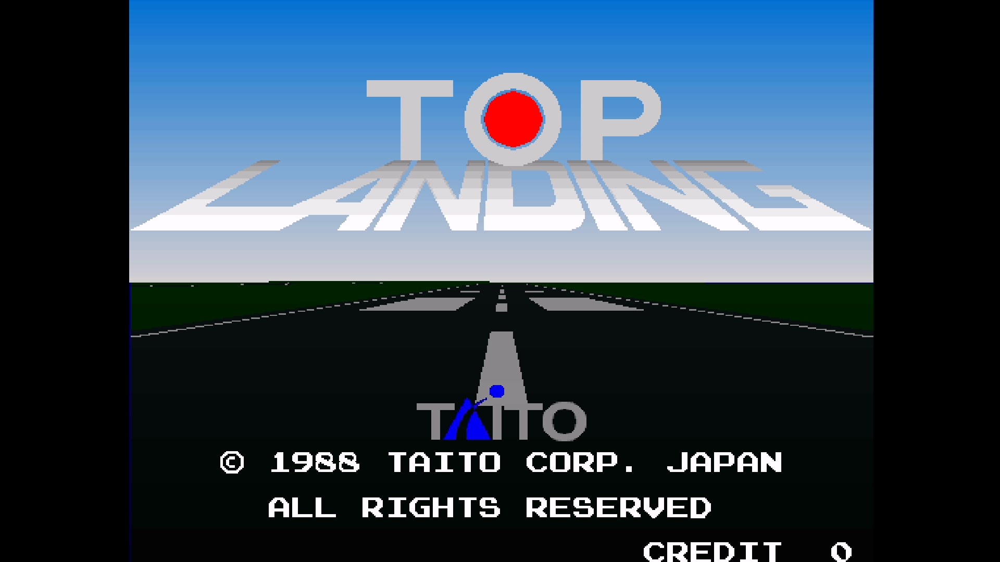
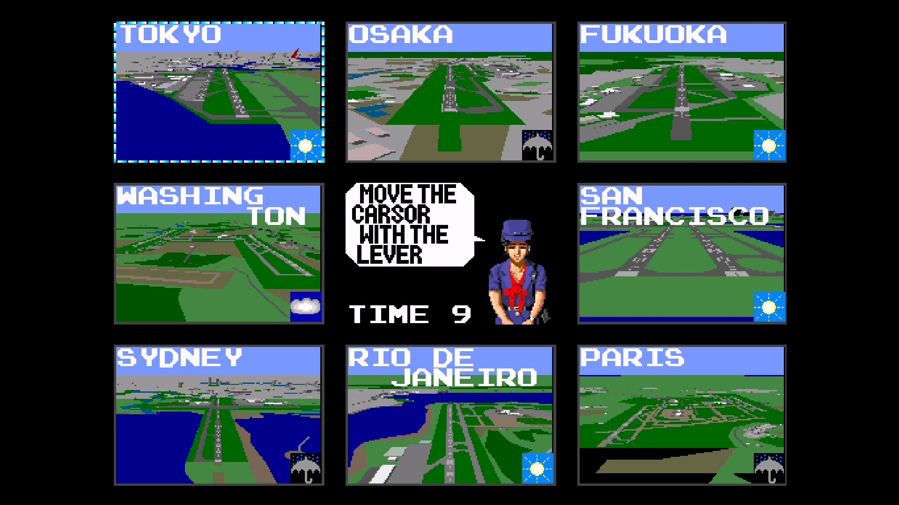
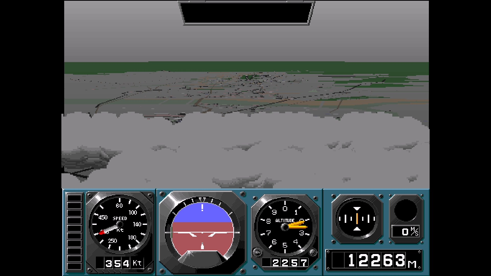

# Taito Air System for MiSTer

FPGA implementation of the Taito Air System arcade platform for the
DE10-Nano/MiSTer. Release 1.0 supports **Top Landing (World)** and runs the
original 68000, Z80 and TMS320C25 programs in FPGA logic.

## Screenshots







## Features

- Original 68000 main program, Z80 sound program and TMS320C25 polygon program.
- Polygon terrain, TC0080VCO tile/sprite rendering and TC0430GRW gradients.
- FPGA-native stereo YM2610 audio with FM, SSG, ADPCM-A and ADPCM-B playback.
- Analog yoke and throttle support with calibrated ranges and optional on-screen
  control indicators.
- Coin, Start, Service, Test Mode, Demo Sounds, coinage and difficulty options.
- Complete ordered 512x400 raster using MiSTer's standard video-processing
  pipeline.
- Exact polygon-span reclamation with 6,144 physical records per display bank.

## Installation and ROM

Release files are in `releases/`:

| File | SHA-1 |
| --- | --- |
| `TaitoAir_1.0.rbf` | `2d27cb01d5418e54c8d66354cbaebe45e10cb1a0` |
| `Top Landing (World).mra` | `6a79d0b6f100260194aa226203cb58281f91786b` |

Copy the RBF to MiSTer's `_Arcade/cores` directory and the MRA to `_Arcade`.
Place the unmodified MAME `topland.zip` World ROM set in a MiSTer arcade ROM
search directory. Game ROMs are not included.

## Build and test

The Quartus project targets Quartus Lite 24.1:

```sh
quartus_sh --flow compile TaitoAir
make -j6 test
```

## Source and licensing

This repository includes third-party FPGA components under their original
licenses and copyright notices:

- fx68k, GPL-3.0.
- JT12/JT10 and JT49, GPL-3.0-or-later.
- TV80, MIT.
- The standard MiSTer framework and its upstream notices.

The imported JT12 base is commit `eaab7e1de6594982a299bc9101dc882384b85685`.
The integration adds ADPCM-A lookahead outputs to `jt10.v`, `jt12_top.v`,
`jt10_adpcm_drvA.v` and `jt10_adpcm_cnt.v` so the DDR cache can prefetch without
changing decoder or audio arithmetic. TV80 was imported from the MiSTer Taito
F2 core at commit `9438df98f1ea826c5398db43587992def0124603`.
